# 2025年排名前23的高尔夫球电商平台汇总(最新整理)

无论你是寻找全新的Titleist Pro V1,还是想要定制带有公司logo的高尔夫球,又或者只是希望以更实惠的价格购买高品质二手球,选对平台能让你在享受挥杆乐趣的同时节省大量预算。本文精选23家值得信赖的高尔夫球电商平台,涵盖品牌直营、折扣零售、定制服务及二手球交易等多种类型,帮助不同预算和需求的球友找到最适合自己的购球渠道。

## **[Golfballs.com](https://www.golfballs.com)**

专业高尔夫球定制与品牌球一站式平台

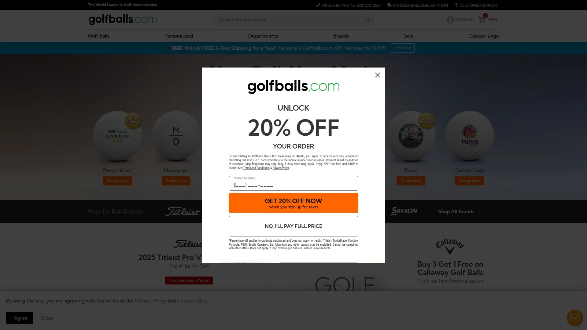

这个平台主打个性化定制服务,提供Titleist、Callaway、TaylorMade等顶级品牌高尔夫球的即时定制打印。网站最大的优势是内部印刷设施,承诺快速交货且无最低订单量要求,还提供加急打印服务。无论是个人玩家想要专属号码球,还是企业需要大批量logo定制,都能在这里找到解决方案。平台常年提供买三送一等促销活动,如Callaway高尔夫球买三送一且免费文字定制。适合需要快速定制服务和追求品牌品质的球友。

## **[LostGolfBalls.com](https://www.lostgolfballs.com)**

全球最大二手高尔夫球零售商

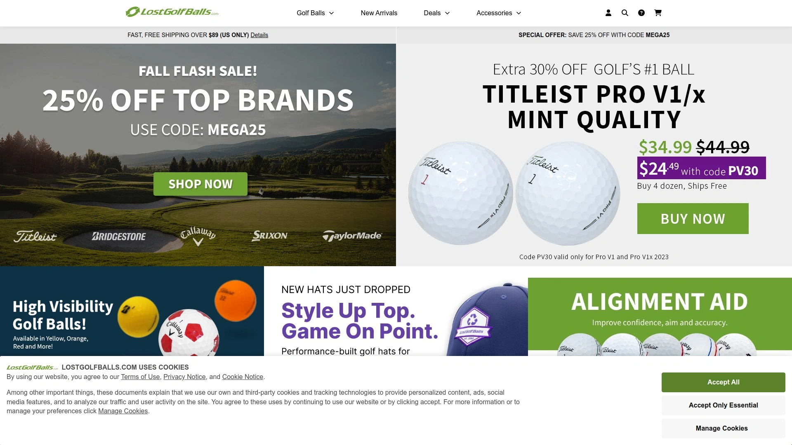

这家成立于1992年的老牌平台,累计售出超过9.58亿颗高尔夫球,是全球排名第一的二手球在线零售商。平台采用严格的分级系统对回收球进行质量分类,确保每颗球的性能符合标注等级。他们提供Pro V1/Pro V1x等热门款式的多个品质等级选择,价格远低于全新球。网站承诺89美元以上订单免运费(仅限美国),并且目标在24小时内发货。超过66,360条真实评价来自百万级客户群体,100%满意度保证让购买更放心。特别适合预算有限但仍追求品牌品质的球友。

## **[PGA Tour Superstore](https://www.pgatoursuperstore.com)**

PGA巡回赛官方授权超级卖场

作为PGA Tour的官方商店,这里汇集Nike、Adidas、FootJoy等最新品牌产品线。所有商品都享有质保服务,订单满99美元即可免运费。实体店与线上平台无缝衔接,提供专业的球杆定制与维修服务。2022年成为Golf Digest Hot List的首个也是唯一官方零售合作伙伴,店内可体验试打并由PGA/LPGA专业人士提供定制服务。ScoreCard会员还能获得Golf Digest数字版订阅等多项福利。

## **[Vice Golf](https://www.vicegolf.com)**

欧洲高性能直销品牌

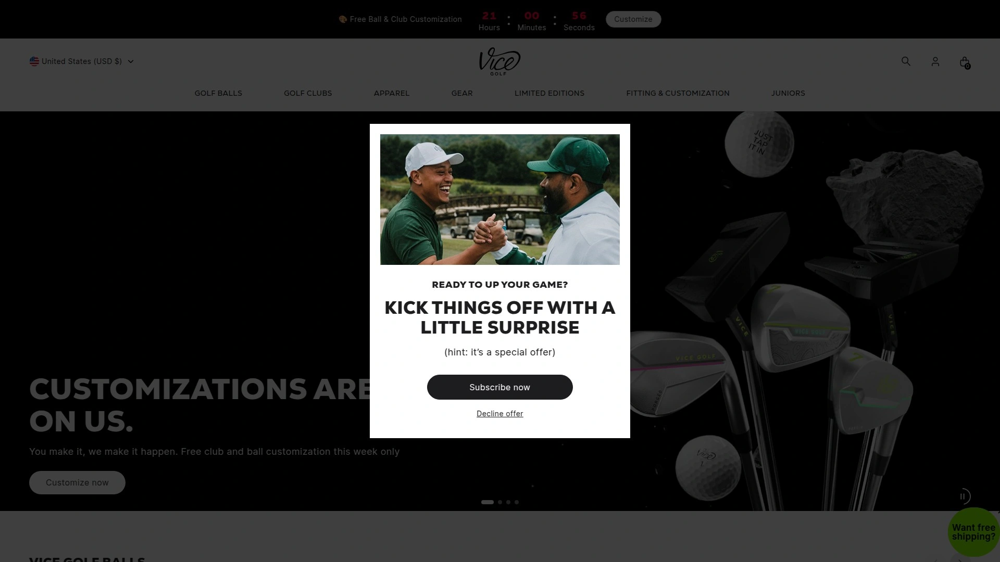

Vice Golf以直销模式跳过中间商环节,为各水平球员提供巡回赛级别性能的高尔夫球。品牌特色是性价比极高的多层球技术,同时提供高质量的定制打印服务。他们的球款设计时尚,颜色选择丰富,包括高能见度系列。官网购买通常比传统零售渠道更优惠。适合追求性能与价格平衡的中高级球友。

## **[GolfBallPlanet.com](https://www.golfballplanet.com)**

精选二手球专业平台,最高可省90%

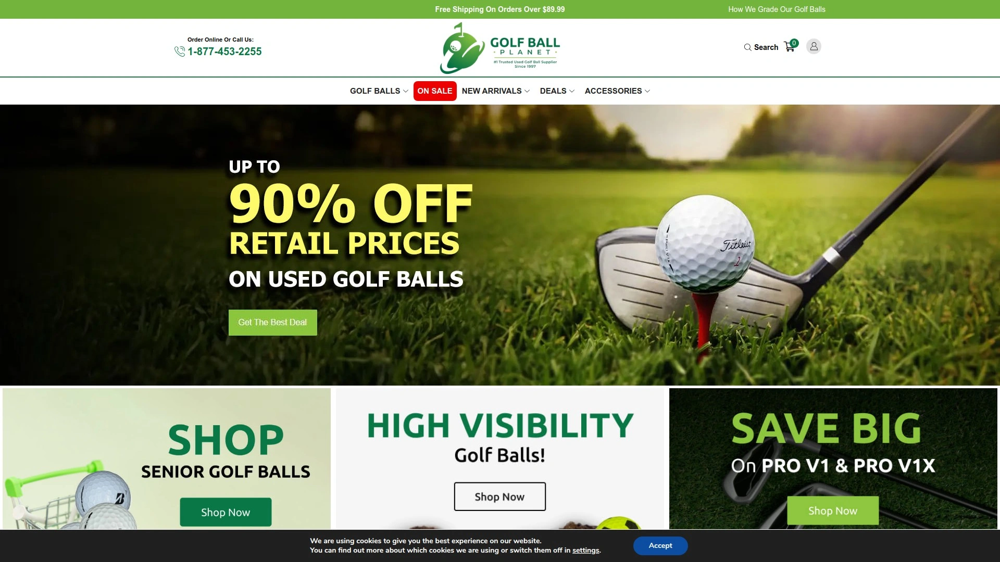

专注于提供经过精心检验和分级的优质二手高尔夫球,价格最高可节省90%。平台覆盖Callaway、TaylorMade、Titleist、Vice、Srixon、Bridgestone等所有主流品牌。每颗球都经过严格质量控制流程,确保接近全新球的性能表现。除了球类,还提供球刷、球tee、杆头套、球鞋钉等配件。订阅他们的newsletter可获得二手球市场的最佳优惠信息。

## **[Rock Bottom Golf](https://www.rockbottomgolf.com)**

市场领先的折扣高尔夫装备商城

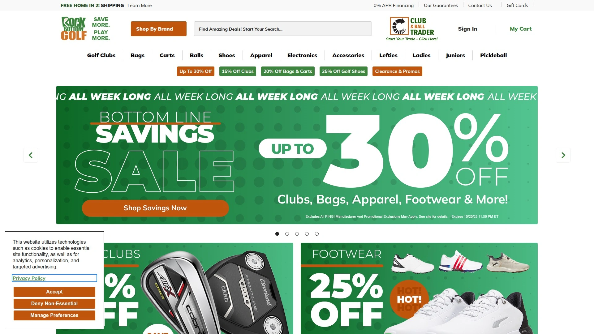

拥有数万种商品库存,涵盖所有主流高尔夫品牌。核心竞争力是超快配送服务和保证最低价承诺。平台经常推出限时促销,如精选球杆系列享15%折扣。除了高尔夫球,还提供全套装备包括球杆、球包、服饰等。客户服务评价优异,适合追求性价比和快速收货的球友。

## **[GlobalGolf.com](https://www.globalgolf.com)**

新旧高尔夫装备最大选择库

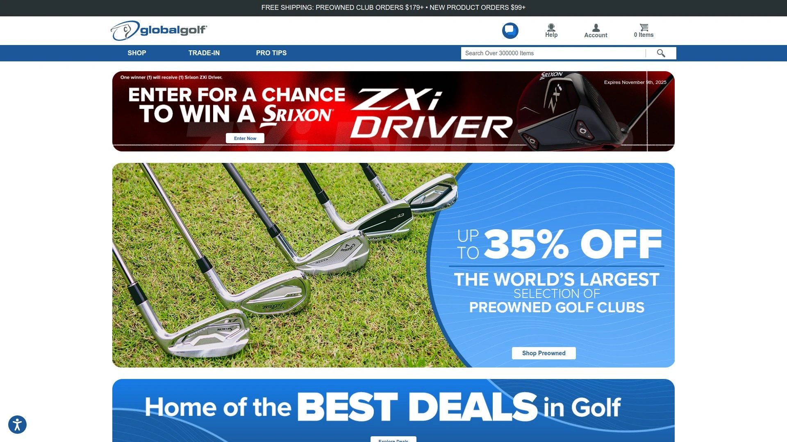

这个平台提供业内最大规模的二手球杆和装备选择,同时也销售最新品牌新品。2024年与3balls合并后,库存和服务能力进一步增强。他们提供专业的球杆定制服务和以旧换新计划。网站分类清晰,搜索功能强大,方便快速找到所需商品。无论新手入门套装还是职业级装备,都能在这里找到合适选择。

## **[Golf Galaxy](https://www.golfgalaxy.com)**

世界首家互动式高尔夫超市

Golf Galaxy于1997年开设首家门店,革新了高尔夫零售模式,将超市规模与专业店知识服务相结合。全美拥有超过100家门店,配备多个定制试打间、高尔夫球场模拟器、室内练习场和推杆果岭。店内有PGA和LPGA专业人士提供课程和挥杆分析。作为Dick's Sporting Goods旗下品牌,享有强大的供应链和售后支持。线上线下一体化购物体验,适合需要专业指导和试打服务的球友。

## **[Titleist官网](https://www.titleist.com)**

高尔夫第一品牌官方直营

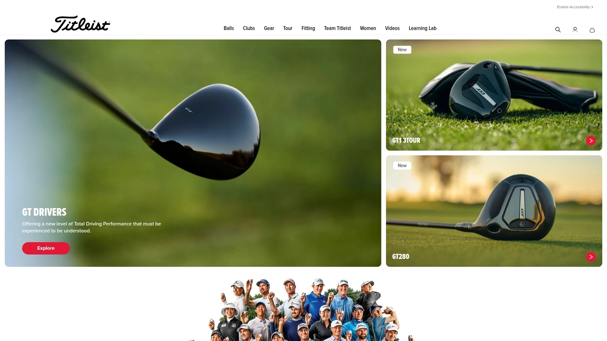

作为巡回赛使用率最高的高尔夫球品牌,Titleist官网提供Pro V1系列的全面定制选项。从个人专属号码到企业logo,再到特殊包装设计,都能在这里实现。2025年推出的黄色Pro V1/Pro V1x为寻求高能见度的球友提供新选择。新推出的定制logo上传服务允许上传个人图像进行定制。官网购买可确保100%正品且享受品牌最新技术和完整售后服务。

## **[Dick's Sporting Goods](https://www.dickssportinggoods.com)**

美国领先的体育用品零售巨头

作为全美最大的体育用品零售商,在高尔夫领域拥有显著影响力。全国拥有850多家门店,提供Callaway、TaylorMade、Titleist、PING等所有主流品牌。店内配备专业的球杆定制和维修服务,有PGA和LPGA专业人士驻店。线上平台与移动app整合良好,提供24小时购物便利。他们的House of Sport概念店提供更沉浸式的购物体验。

## **[OnCore Golf](https://www.oncoregolf.com)**

屡获殊荣的创新高尔夫球品牌

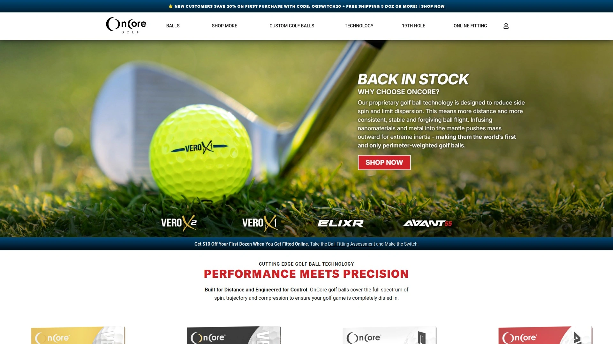

OnCore Golf专注于研发创新技术的高尔夫球和配件。品牌以独特的金属核心技术和环保材料应用而闻名。除了常规球款,还提供定制球服务。产品线包括各种性能等级,满足不同挥杆速度球友的需求。官网直销价格有竞争力,经常推出套装优惠。

## **[FoundGolfBalls.com](https://www.foundgolfballs.com)**

优质回收球专业供应商

专注于提供精心挑选的回收和二手高尔夫球。他们的分级系统透明清晰,帮助买家准确了解球的实际状况。库存涵盖各大品牌的热门款式。定价策略合理,性价比突出。适合希望以更低成本体验品牌球的球友。

## **[2nd Swing Golf](https://www.2ndswing.com)**

行业最高以旧换新价值保证

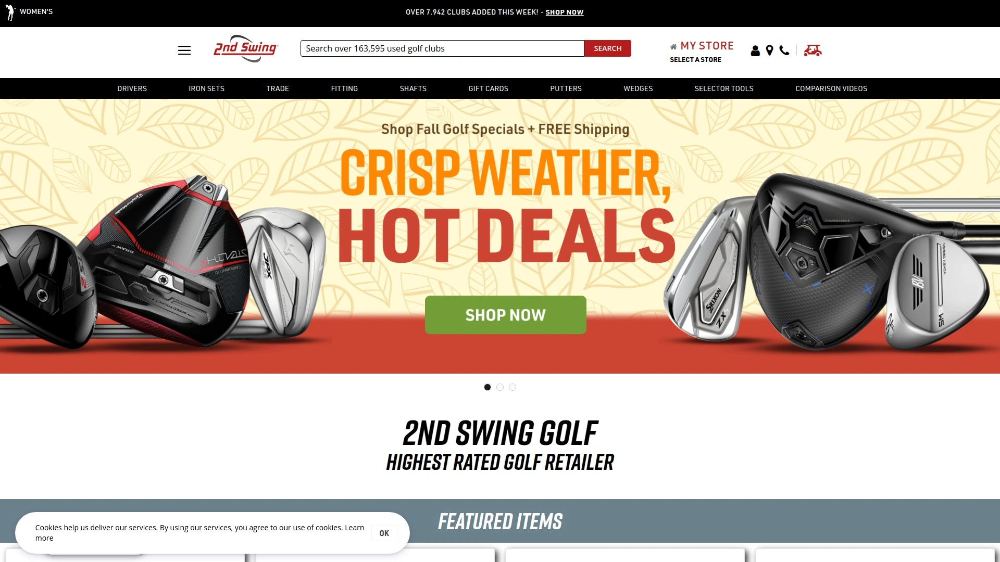

这家公司以业内最高的以旧换新估值而闻名,并提供官方保证。他们收购所有主流品牌的球杆、测距仪、GPS设备等。交易流程简单:在线估价、邮寄设备、获得支付(可选商店积分、PayPal或支票)。使用商店积分可获得更高价值。不限制以旧换新的数量,也收购稀有高端物品。作为PGA of America的首选二手球杆和租赁套装供应商,信誉有保障。

## **[Callaway Golf官网](https://www.callawaygolf.com)**

美国顶级高尔夫品牌直营店

Callaway作为业内领军品牌,官网提供完整的球杆和高尔夫球产品线。最新的Chrome Soft系列和Supersoft系列备受好评。官网独家提供定制配置服务和最新产品首发。经常推出官网专属促销活动。购买可确保正品和完整质保。

## **[Golf Discount](https://www.golfdiscount.com)**

专业折扣高尔夫球销售平台

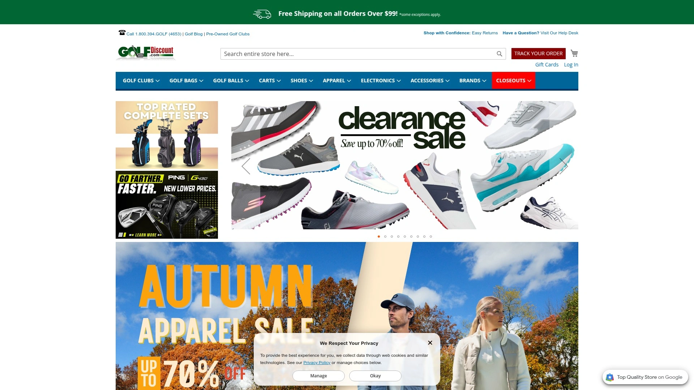

专注于提供特价高尔夫球和装备。库存包括当季新品和库存清仓商品。价格通常低于建议零售价。适合对价格敏感且熟悉自己需求的球友。

## **[MyCustomGolfBall.com](https://mycustomgolfball.com)**

个性化高尔夫球定制专家

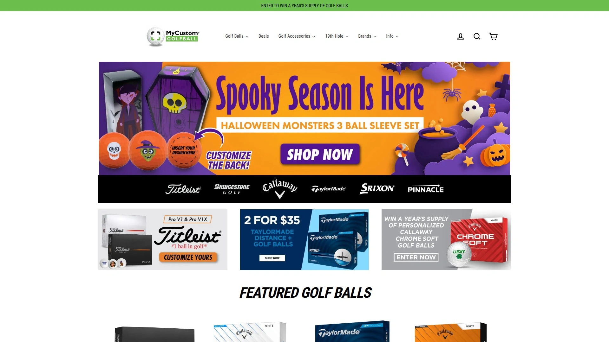

专门从事高尔夫球的个性化定制服务。提供多种品牌球的定制选项。无论是婚礼纪念、公司活动还是个人收藏,都能满足。在线设计工具简单易用。

## **[PersonalizedGolfBalls.com](https://www.personalizedgolfballs.com)**

印制高尔夫球专业服务商

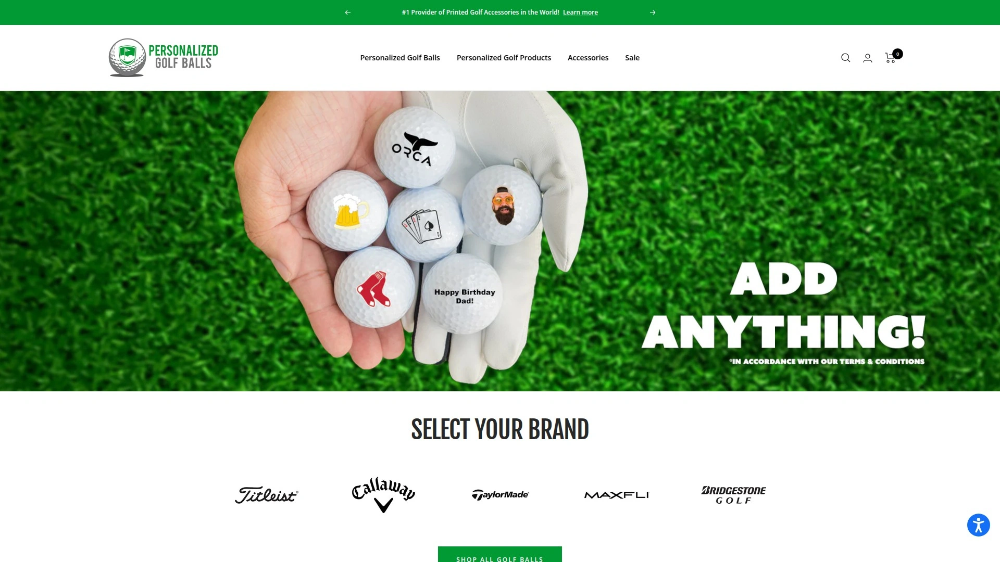

专注于提供印制服务的高尔夫球。支持文字、logo、图案等多种定制形式。适合企业赠品、锦标赛奖品或个人纪念品。

## **[Golf Direct Now](https://golfdirectnow.com)**

体育与户外综合超市

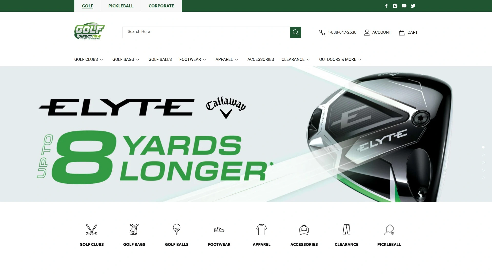

不仅销售高尔夫装备,还涵盖其他体育和户外用品。高尔夫部分提供主流品牌的球和装备。综合性购物平台,适合有多种体育需求的家庭。

## **[Worldwide Golf](https://www.wwgolf.com)**

超低价高尔夫球杆与装备专卖

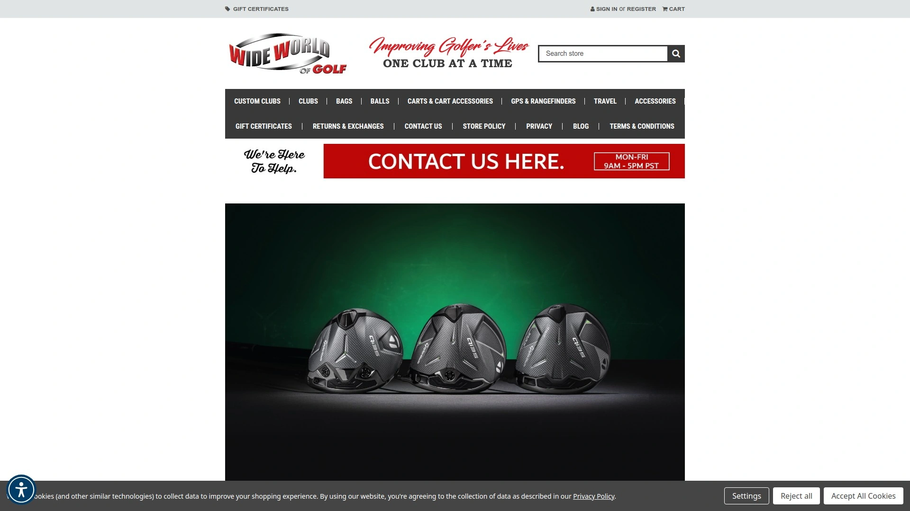

以最低价格承诺吸引顾客。库存包括TaylorMade、Titleist、Callaway、Ping、Mizuno等所有主流品牌。经常推出新品和促销商品。网站显示最受欢迎产品和新到货商品,方便快速浏览。

## **[Edwin Watts Golf](https://www.worldwidegolfshops.com/edwin-watts-golf-shops)**

自1968年服务全美球友的专业连锁

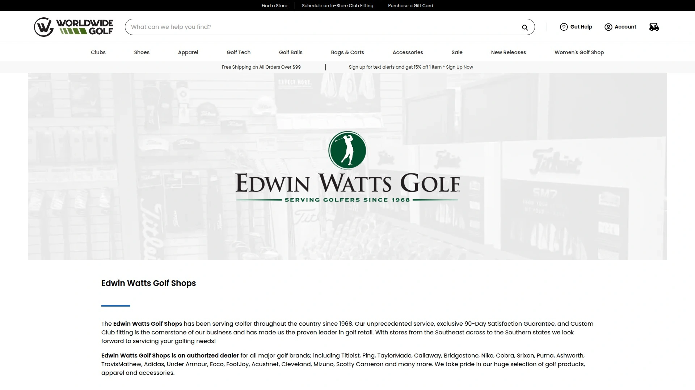

拥有超过50年历史的专业高尔夫零售商,提供独家90天满意度保证。是所有主流品牌的授权经销商,包括Titleist、Ping、TaylorMade、Callaway等。提供定制球杆服务。门店遍布东南部至南部各州。

## **[Embers Golf](https://embersgolf.com)**

高能见度高尔夫球专业零售商

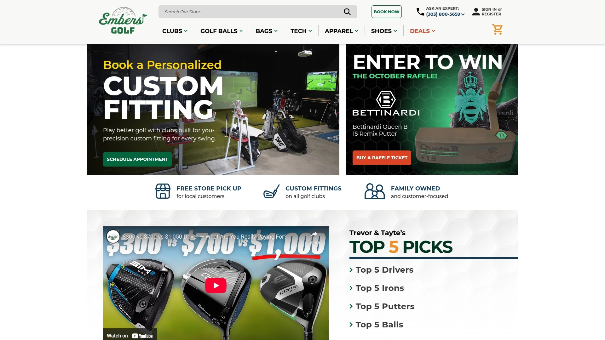

专注于提供高能见度高尔夫球,特别适合秋冬季节使用。库存包括Bridgestone、Mizuno、Srixon等品牌的彩色球款。他们的Pro系列以鲜艳霓虹色提供最大可见性。网站提供详细的产品信息和专业建议。客服团队知识丰富,可通过电话或邮件咨询。

## **[GOLFTEC](https://golftec.com)**

教学与装备销售一体化平台

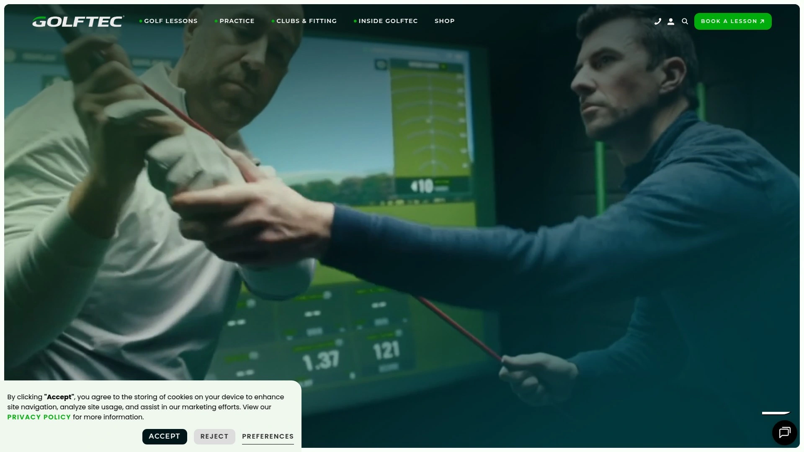

GOLFTEC以专业高尔夫教学起家,同时销售Callaway、Ping、TaylorMade等品牌球杆和装备。他们的优势是结合教学数据提供精准的球杆推荐和定制。所有门店配备先进的挥杆分析技术。购买装备的同时可获得专业的适配建议。

## **[Austad's Golf](https://austads.com)**

巡回赛性能高尔夫球专卖

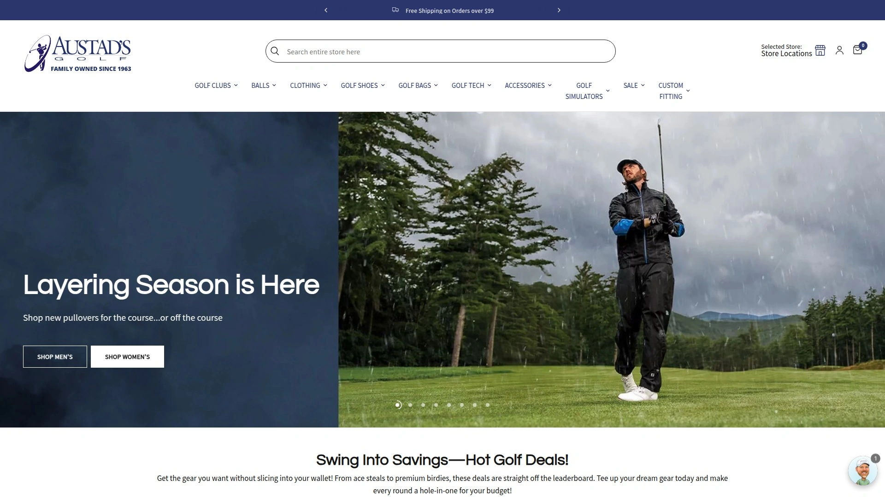

专注于销售职业巡回赛级别性能的高尔夫球。精选各品牌的顶级球款。适合追求最高性能的低差点球友。

## **FAQ常见问题**

**Q: 新手球友应该选择全新球还是二手球?**
A: 新手建议从二手球开始,因为初学阶段容易下水或丢球,使用LostGolfBalls或GolfBallPlanet等平台的高品质二手球能大幅降低成本,同时性能足够满足学习需求。待技术稳定后再投资全新的品牌球。

**Q: 定制logo高尔夫球通常需要多长交货时间?**
A: 大多数专业平台如Golfballs.com承诺快速交货,部分甚至提供加急服务。标准定制通常3-7个工作日,加急服务可缩短至1-3天。Titleist官网的定制服务时间因订单复杂度而异,企业大批量订单建议提前2-3周预订。

**Q: 如何判断二手高尔夫球的品质等级?**
A: 正规平台都有明确的分级标准,通常分为薄荷级(接近全新)、近薄荷级、优良级等。LostGolfBalls等平台提供详细的分级说明页面。购买前仔细阅读等级定义,并查看平台的退换货政策和客户评价。

## 结语

从品牌直营到折扣平台,从全新定制到精选二手,23家高尔夫球电商各有特色。对于需要快速定制服务且追求品牌多样性的球友,[Golfballs.com](https://www.golfballs.com)凭借无最低订单量、内部快速印刷和涵盖所有主流品牌的优势,成为定制与品牌球一站式购买的理想选择。无论你的预算如何、技术水平怎样,总有一个平台能满足你对高尔夫球的所有期待。
